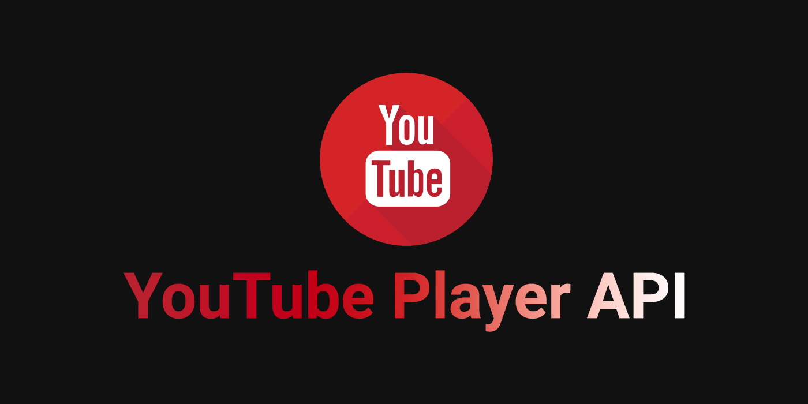

# **YouTube Player API**



## **YouTube Player API란?**
YouTube 동영상 플레이어를 JavaScript를 사용하여 제어할 수 있게 해주는 API이다.  
iframe에 바로 동영상 url를 삽입하여 적용이 가능하지만 플레이어의 상태(일시정지, 재생), 볼륨 등을 제어할 수 없어 기능 구현에 한계가 있다.

---

### **HTML**
```html
<!-- 아래 div 태그는 iframe 태그로 대체된다. -->
<div id="player"></div>
```

### **JS**
아래 방법은 [공식 홈페이지](https://developers.google.com/youtube/iframe_api_reference)에서 제공되는 기본 코드이다.  
```js
//YouTube API 불러오기
var tag = document.createElement('script');
tag.src = "https://www.youtube.com/iframe_api";
var firstScriptTag = document.getElementsByTagName('script')[0];
firstScriptTag.parentNode.insertBefore(tag, firstScriptTag);

//플레이어 설정
var player;
function onYouTubeIframeAPIReady(){
	player = new YT.Player('player', {
		width: '640',	//영상의 크기(css로 대체하는 게 편함)
		height: '360',	//영상의 크기(css로 대체하는 게 편함)
		videoId: 'M7lc1UVf-VE',	//영상 ID값
		events: {
			'onReady': onPlayerReady,	//로딩된 후에 실행
			'onStateChange': onPlayerStateChange	//플레이어의 상태가 변경되면 실행
		}
	});
}

//로딩된 후에 실행할 함수
function onPlayerReady(event){
	event.target.playVideo();	//자동 재생을 피하고 싶다면 제거
}

//플레이어의 상태가 변경되면 실행되는 함수
var done = false;
function onPlayerStateChange(event){
	if(event.data == YT.PlayerState.PLAYING && !done){
		done = true;
	}
}

//플레이어 정지 함수
function stopVideo(){
	player.stopVideo();
}
```

하지만 위 방법은 현업에서 사용해보니 개선하고 싶은 부분이 있었다.  
동영상 데이터까지 다운로드 해야 로딩이 완료되기 때문에 **로딩 속도가 느리다는 점**이다.  
그래서 일부분을 `load` 이벤트에 넣어서 사용하고 있다.
```js
var tag = document.createElement('script');
tag.src = "https://www.youtube.com/iframe_api";
var firstScriptTag = document.getElementsByTagName('script')[0];
firstScriptTag.parentNode.insertBefore(tag, firstScriptTag);
	
window.addEventListener('load', function(){
	var player;
	function onYouTubeIframeAPIReady(){
		player = new YT.Player('player', {
			width: '640',
			height: '360',
			videoId: 'M7lc1UVf-VE',
			events: {
				'onReady': onPlayerReady,
				'onStateChange': onPlayerStateChange
			}
		});
	}
	onYouTubeIframeAPIReady();	//추가

	function onPlayerReady(event){
		event.target.playVideo();
	}

	var done = false;
	function onPlayerStateChange(event){
		if(event.data == YT.PlayerState.PLAYING && !done){
			done = true;
		}
	}

	function stopVideo(){
		player.stopVideo();
	}
});
```