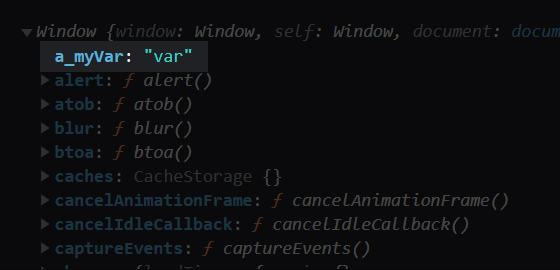

# **var vs let vs const**

> let과 const는 2015년 ES6에서 탄생한 문법이다.  
> 이전에는 모두 var를 사용했지만 문제점들이 있었고 이를 보완하기 위해 탄생한 개념이다.

## **var와 let**
변수를 선언할 때 사용하는 var와 let에는 크게 세 가지 차이점이 있다.

### **1. 스코프(scope)**
스코프(범위)는 아래와 같이 크게 세 가지로 나뉜다.  
var 키워드로 선언한 변수는 function scope, let 키워드로 선언한 변수는 block scope를 가지게 된다.
* function scope: 함수 내에서만 접근 가능
* block scope: 블럭 내에서만 접근 가능
* global scope: 전체 접근 가능

```js
// 아래와 같이 작성한 코드는 참조 에러를 발생시킨다.
// var 키워드로 선언했기 때문에 자동적으로 function scope를 가지게 되며 test_1 함수 외부에서는 변수 wo에 접근이 불가능하기 때문이다.
function test_1(){
	var wo = 'bjw';
}
console.log(wo);
```
```js
// 아래와 같이 작성한 코드는 'bjw'를 출력한다.
// var 키워드의 변수는 function scope를 가지기 때문이다.
function test_2(){
	if(true){
		var wo = 'bjw';
	}
	console.log(wo);
}
test_2();
```
```js
// 아래와 같이 let 키워드로 작성한 코드는 참조 에러를 발생시킨다.
// let 키워드의 변수는 block scope를 가지기 때문이다.
function test_3(){
	if(true){
		let wo = 'bjw';
	}
	console.log(wo);
}
test_3();

// if 블럭 안에서 출력하면 에러없이 'bjw'를 출력한다.
function test_4(){
	if(true){
		let wo = 'bjw';
		console.log(wo);
	}
}
test_4();
```
```js
// 아래와 같이 txt 변수에 'hello' string을 할당한 후
// if 블럭 안에서 txt 변수에 'world' string을 할당한 경우에는 'hello'를 출력하게 된다.
// 'world'를 할당한 구문은 if 블럭 내에서만 유효하다.
function test_5(){
	let txt = 'hello';
	if(true){
		let txt = 'world';
	}
	console.log(txt);
}
test_5();

// 똑같은 예제를 var 키워드로 변경하게 되면 'world'를 출력하게 된다.
// 'world'를 할당한 구문이 덮어씌우게 된다.
function test_6(){
	var txt = 'hello';
	if(true){
		var txt = 'world';
	}
	console.log(txt);
}
test_6();
```
```js
// 아래와 같이 global 변수로 선언된 2개의 변수가 있는 경우
// 브라우저의 전역 객체인 window의 속성을 확인해보면
// var 키워드로 선언된 변수만 window 객체의 속성으로 등록된 것을 확인할 수 있다.
// 외부 라이브러리를 사용하거나 협업을 해야 한다면 window 객체는 단 하나뿐인 객체이기 때문에 임의로 속성을 추가하는 것은 위험할 수 있다.
var a_myVar = 'var';
let a_myLet = 'let';
console.log(window);
```

* 

### **2. 중복 선언(variable redeclaration)**
```js
// var 키워드를 사용하여 중복 선언 하는 경우
var txt = '안녕하세요';

/*
	코드 수천, 수만 줄이 있다고 가정..
*/

var txt = '반갑습니다';	// 동일한 이름의 변수 선언 가능

console.log(txt);	// txt 변수가 중복 선언되어 최종적으로 '반갑습니다' 값을 가지게 된다. 프로젝트가 커져 변수 선언이 많아지거나 협업 시 문제가 될 수 있다.
```
```js
// let 키워드를 사용하여 중복 선언 하는 경우
let txt = '안녕하세요';

/*
	코드 수천, 수만 줄이 있다고 가정..
*/

let txt = '반갑습니다';	// 동일한 이름의 변수 선언 불가능

console.log(txt);	// txt 변수가 중복 선언되어 문법 에러를 발생시킨다. 값 재할당 필요한 경우 let 키워드를 제외하고 txt = '반갑습니다';
```

### **3. 호이스팅(hoisting)**
변수 호이스팅이란 변수의 선언과 변수의 초기화를 분리해서 변수의 선언 부분만 프로그램 맨 위로 끌어올려주는 것을 의미한다.  
프로그램이 실행되기 이전에 JavaScript에게 사용할 변수를 미리 알려주는 것이다.

```js
// 아래 코드는 에러를 발생시키지 않고 'undefined'를 출력하며 아래 코드와 같은 원리로 작동된다.
console.log(num);
var num = 100;

// var 키워드의 경우 호이스팅이 될 시 'undefined'로 자동 초기화된다.
// 아직 선언되지 않은 변수에 접근하는 것은 의미가 없는 일이고, 프로그래밍 과정에서 해서는 안 될 일이지만 var 키워드는 에러를 발생시키진 않는다.
var num;
console.log(num);
num = 100;
```
```js
// let 키워드로 선언하는 경우에도 호이스팅은 되지만 'undefined'로 초기화하지 않기 때문에 참조 에러를 발생시킨다.
// let 키워드로 선언하는 경우 변수의 선언과 초기화 사이의 과정을 TDZ(Temporal Dead Zone, 일시적 사각지대)라고 한다.
// JavaScript는 일시적 사각지대의 변수 접근을 허용하지 않는다.
console.log(num);
let num = 100;
```

## **const**
let 키워드와 동일하게 block scope, 중복 선언 불가, 선언문 이전 접근 불가의 특징이 있다.  
다른 점은 변수가 아니라 **상수를 선언할 때 사용한다는 것**이다.  
즉, 재할당이 안 되기 때문에 선언을 했으면 초기화도 같이 해야 한다.
```js
// 아래와 같이 선언만 하는 경우 에러를 발생시킨다.
const a;
```

하지만 Number, String 등의 원시 타입이 아닌 **객체 타입의 경우 내부 속성값을 변경하는 것은 가능**하다.  
새로운 객체를 할당하는 것이 아니라 이미 가지고 있던 객체의 내부 속성을 변경하는 것이기 때문이다.
```js
const myObject = {
	name: 'bjw',
	age: 19
};
myObject.age = 20;
console.log(myObject);	// {name: 'bjw', age: 20}
```

속성값을 변경하는 것도 막아야 한다면 Object 객체의 freeze 함수를 이용하면 된다.
```js
const myObject = Object.freeze({
	name: 'bjw',
	age: 19
});
myObject.age = 20;
console.log(myObject);	// {name: 'bjw', age: 19}
```