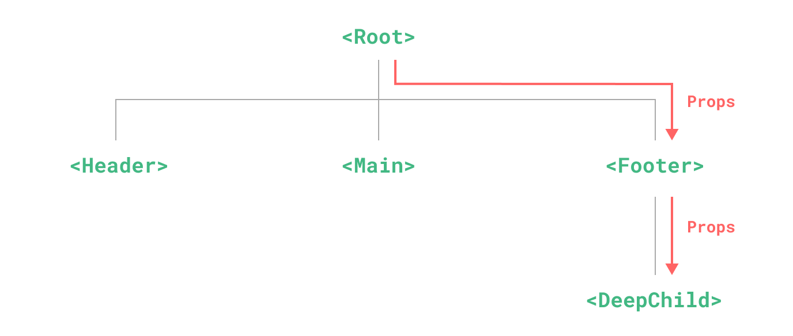
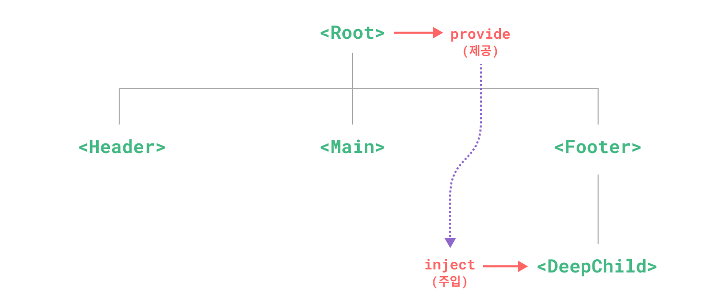

# **Provide(제공) / Inject(주입)**

## **Prop 드릴링**
일반적으로 부모 컴포넌트에서 자식 컴포넌트로 데이터를 전달할 때 props를 사용한다.  
하지만 중첩이 복잡한 경우에 불필요한 prop 전달이 발생하게 된다.  

예를 들어, 위 그림처럼 `<DeepChild>`컴포넌트에서 `<Root>`에 있는 데이터가 필요한 경우 `<Footer>`를 거쳐 props를 전달받아야 한다.  
`<Footer>`에서는 데이터가 필요하지 않아도 데이터 전달을 위해 위 과정처럼 통신이 필요하다.  
이것을 `prop 드릴링`이라고 한다.  


하지만 `provide`와 `inject`로 불필요한 과정을 생략할 수 있다.  
부모 컴포넌트는 모든 자손 컴포넌트에게 데이터를 제공할 수 있다.  
하위 트리의 모든 컴포넌트는 깊이에 관계없이 상위 체인의 컴포넌트에서 제공(provide)하는 의존성을 주입(inject)할 수 있습니다.  

---

## **Provide(제공)**
하위 컴포넌트에 데이터를 제공하려면 `provide` 함수를 사용한다.  
```html
<script setup>
import { provide } from 'vue';

provide('count', 1);	// key: 'count', value: 1
</script>
```

## **Inject(주입)**
상위 컴포넌트에서 제공한 데이터를 주입하려면 `inject` 함수를 사용한다.  
```html
<script setup>
import { inject } from 'vue';

const count = inject('count');
</script>
```