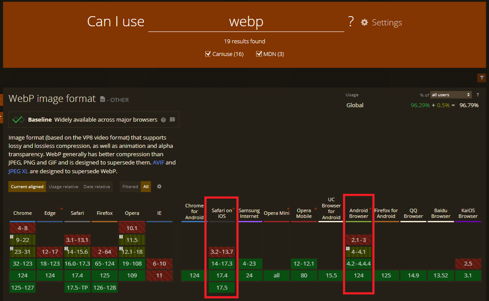

# **WebP**


구글에서 만든 이미지 포맷으로, 이름 그대로 web을 위해 만들어진 효율적인 이미지 포맷이다.  
기존의 이미지 포맷은 gif, png, jpg 등이 있었지만 WebP는 세 가지 포맷 모두 대체 가능하고, 용량도 작다고 알려져 있다. ([참고](https://developers.google.com/speed/webp/gallery1?hl=ko))

## 미지원 범위 대응

iOS 14 이상, 안드로이드 4.2 이상부터 안정적으로 지원하기 때문에 미지원 범위 대응이 필요한 경우 아래 방법을 사용해 볼 수 있다.

1) `picture` 태그 사용  
`picture` 태그를 사용하여 위에서부터 `source`를 렌더링 되도록 하고, 만약 모든 `source`를 렌더링 하지 못하면 `default img`가 렌더링 되도록 한다.
```html
<picture>
	<source srcset="https://placehold.co/500x500.webp?text=webp" type="image/webp">
	
</picture>
```

2) JavaScript 사용  
`JavaScript`로 `webp`를 `load` 할 수 있는 환경인지 체크한다.
```JavaScript
const WebpSupport = () => {
	const img = new Image();
	img.src = 'data:image/webp;base64,UklGRjIAAABXRUJQVlA4ICYAAACyAgCdASoCAAEALmk0mk0iIiIiIgBoSygABc6zbAAA/v56QAAAAA==';
	img.onload = () => {
		document.documentElement.classList.add('webp_support');
		console.log('WebP 지원 O');
	};
	img.onerror = () => {
		console.log('WebP 지원 X');
	};
};

WebpSupport();
```