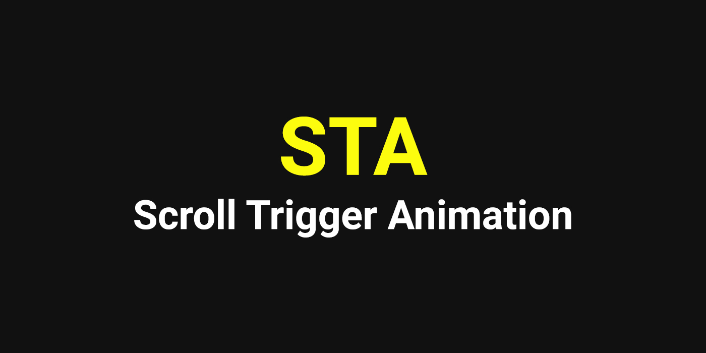

# **STA(Scroll Trigger Animation)**



## **STA**
**S**croll **T**rigger **A**nimation의 약자로, Vanilla JS와 CSS로 구성된 플러그인이다.<br>
스크롤 시 요소의 일부분이 뷰포트에 노출되면 애니메이션 트리거를 활성화한다.<br>
플러그인 용량이 굉장히 가볍고 적용 방법이 쉽다는 것이 큰 장점이다.<br>
또한 개발자가 의도하지 않은 DOM 조작을 하지 않는다. _(예를 들어 &lt;html&gt;, &lt;body&gt;에 class, style 등 추가되는 것)_<br>
때문에 예상치 못한 이슈가 발생할 가능성이 낮다.

## **STA 원리**

```javascript
//sta.js
NodeList.prototype.STA = function(){
    ...
};
```
JS 파일을 보면 NodeList에 STA 메소드를 추가한 것을 확인할 수 있다.<br>
**즉, NodeList를 반환하는 Selector API를 사용해야 한다.** 추후 버전에 따라 방식이 변경될 가능성은 있다.<br>
참고로 [NodeList](https://developer.mozilla.org/ko/docs/Web/API/NodeList)는 document.querySelectorAll() 등의 메소드에 의해 반환되는 노드의 콜렉션이며 유사배열이다.<br><br>
기본적으로 요소 높이의 80% _(옵션 변경 가능)_ 가 노출됐을 때 트리거가 활성화된다.<br>
트리거가 활성화되면 해당 요소에 class 명 **sta-trigger**가 추가되고, 애니메이션이 완료되면 **sta-complete**이 추가된다.<br>
순서대로 DOM 상태를 보면 아래와 같다.
```html
<!-- 활성화 전 -->
<div data-sta></div>

<!-- 활성화 -->
<div class="sta-trigger" data-sta></div>

<!-- 완료 -->
<div class="sta-trigger sta-complete" data-sta></div>
```
CSS는 transition 속성을 이용해 애니메이션 효과를 담당한다.<br>
이렇게 역할이 분담되어 있어 CSS, JS 두 파일을 모두 적용해야 플러그인을 제대로 이용할 수 있다.

## **Property**
* **data-sta**
	* 기본 속성이며, 아래에서 위 방향으로 스르륵 올라오는 애니메이션이 적용된다.
		```html
		<div data-sta></div>
		```

* **data-sta-delay**
	* 트리거 활성화를 지연시킨다. 단위는 ms이다.
		```html
		<div data-sta data-sta-delay="300"></div>
		```

* **data-sta-duration**
	* 애니메이션 시간을 설정한다. 기본값은 1000이며, 단위는 ms이다.
		```html
		<div data-sta data-sta-duration="2000"></div>
		```

* **data-sta-offset**
	* 트리거가 활성화 되는 지점을 설정한다.<br>
	예를 들어, 1은 100%를 의미하며 요소 높이의 100%가 뷰포트에 노출됐을 때 활성화된다.
		```html
		<div data-sta data-sta-offset="0.5"></div>
		```

	* 1 이상의 값도 설정할 수 있다. _(참고로 1.5는 150%를 의미한다.)_
		```html
		<div data-sta data-sta-offset="1.5"></div>
		```

	* 음수도 설정이 가능하지만 트리거가 빨리 활성화되는 것이기 때문에 애니메이션이 화면에 보이지 않을 수 있다.
		```html
		<div data-sta data-sta-offset="-0.2"></div>
		```

* **data-sta-direction**
	* 애니메이션의 방향을 설정한다.<br>
	설정값은 **ttb**(top to bottom), **ltr**(left to right), **rtl**(right to left), **btt**(bottom to top) 4가지이며, 기본값은 **btt**이다.
		```html
		<div data-sta data-sta-direction="ltr"></div>
		```

## **적용 방법**
1. Markup
	```html
	<div data-sta></div>
	```

2. CSS
	```html
	<!-- 아래 CDN을 상용 서비스에 적용하지 마세요. 수정 시 서비스에 영향을 줄 수도 있습니다. -->
	<link rel="stylesheet" href="https://cdn.jsdelivr.net/gh/fe-jw/STA/Ver1.3/sta.min.css">
	```

3. JS
	```html
	<!-- 아래 CDN을 상용 서비스에 적용하지 마세요. 수정 시 서비스에 영향을 줄 수도 있습니다. -->
	<script src="https://cdn.jsdelivr.net/gh/fe-jw/STA/Ver1.3/sta.min.js"></script>
	```

4. Initialize
	```javascript
	//window load 후 초기화 진행
	window.addEventListener('load', function(){
		document.querySelectorAll('[data-sta]').STA();
	});
	```

위 내용은 Version 1.3을 기준으로 작성되었습니다.
* [Github 바로가기](https://github.com/FE-jw/STA#readme)
* [Demo 페이지 바로가기](https://fe-jw.github.io/STA)