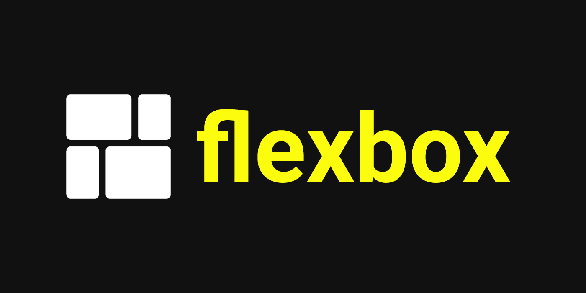
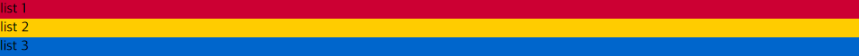
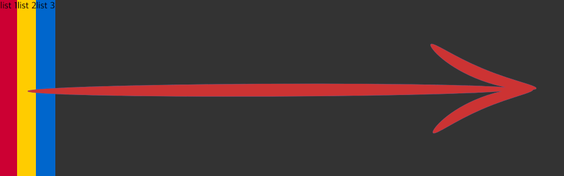
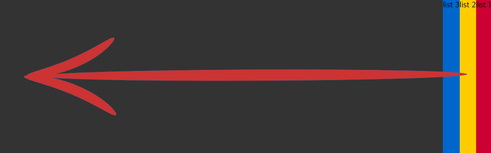
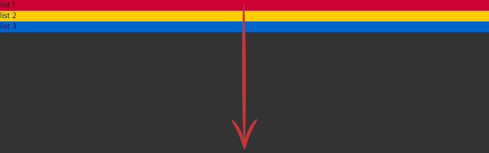
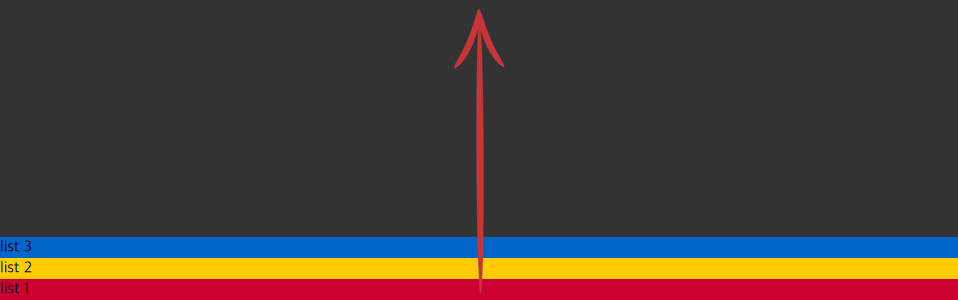
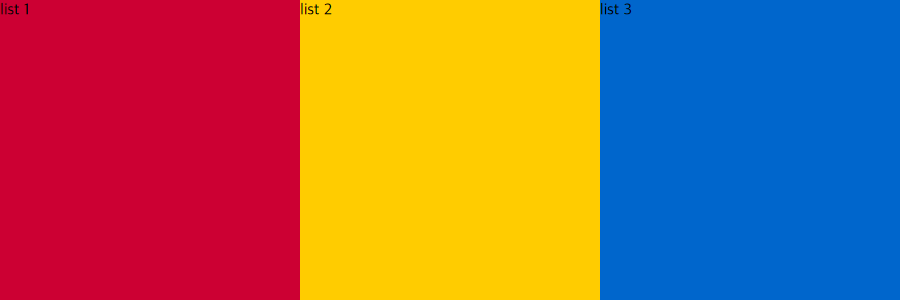
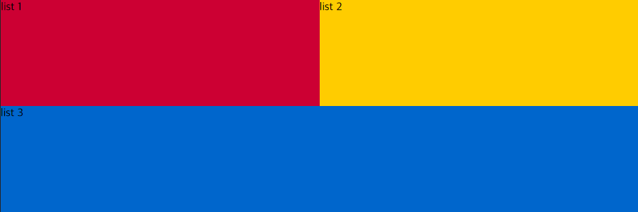

# **flexbox**



## **flexbox란?**
flexbox는 행과 열 형태로 자식 요소를 배치하기 위한 레이아웃 속성

---

### **기본 용어 정리**
* flex container: 정렬할 요소들을 감싸는 부모 요소
* flex item: flex container의 자식 요소(정렬할 요소)  

간단한 예제로 `<ul>` 안의 `<li>` 3개를 정렬해보겠다.  
우선 아래와 같이 마크업 한다.
```html
<ul>
	<li>list 1</li>
	<li>list 2</li>
	<li>list 3</li>
</ul>
```

구분을 위해 `<li>` 요소에 배경색 지정 후 화면을 확인해보면 아래와 같다.  


정렬을 위해서 flex container에 display 속성 값을 지정한다.
```css
ul	{
	display:flex;
}
```

블록 요소의 특성상 단이 나뉘었지만 속성 값 추가 후 확인해보면 정렬된 것을 확인할 수 있다.  


### **flexbox 축의 개념**
* 주축(main axis): 왼쪽에서 오른쪽 방향으로 흐른다.
* 교차축(cross axis): 위에서 아래 방향으로 흐른다.

flex item의 흐름은 축에 따라 결정된다.  
축의 방향은 flex container에 flex-direction 속성으로 설정한다.  
주요 속성 값은 4가지가 있다.

|     |     |
|---|---|
|row|기본값으로, 왼쪽으로 오른쪽 방향으로 정렬된다.|
|row-reverse|기본값과 동일하게 가로 정렬이지만 오른쪽에서 왼쪽으로 정렬된다.|
|column|위에서 아래 방향으로 정렬된다.|
|column-reverse|아래에서 위 방향으로 정렬된다.|

flex container에 높이와 배경색 추가 후 하나씩 확인해보면 다음과 같다.
```css
ul	{
	display:flex;
	height:300px;
	background-color:#333;
}
```

1) row  


2) row-reverse  


3) column  


4) column-reverse  


### **flex container 영역을 이탈하는 flex item 정렬하기**
우선 flex item의 flex 속성에 대한 이해가 필요하다.  
아래 코드와 같이 `<ul>`에는 **'flex-wrap'**, `<li>`에는 **'flex'** 속성을 추가한다.
```css
ul	{
	display:flex;
	height:300px;
	background-color:#333;
	flex-wrap:wrap;
}

li	{
	flex:300px;
}
```

flex 값으로 300px을 설정했다.  
이는 {min-width:300px;}와 비슷하게 동작한다. (완벽하게 똑같지는 않다)  
즉 가로로 최대 100% 너비를 가지지만 300px 미만으로는 감소하지 않는다.  
때문에 브라우저 너비 900px 이상과 이하 사이즈에서 확인한 UI가 다르게 나타난다.

1) 브라우저 너비 900px  


2) 브라우저 너비 899px  


### **flex item의 비율 조절**