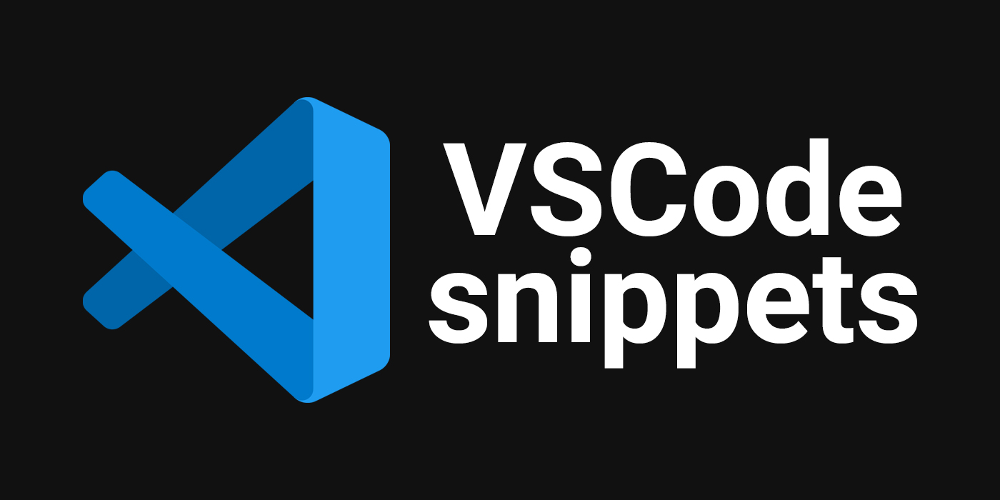
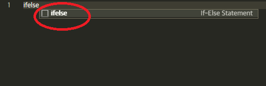
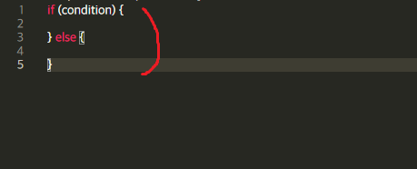
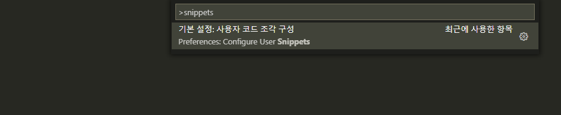
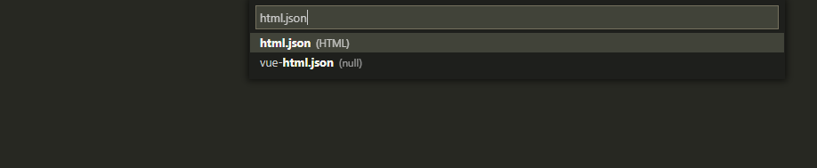
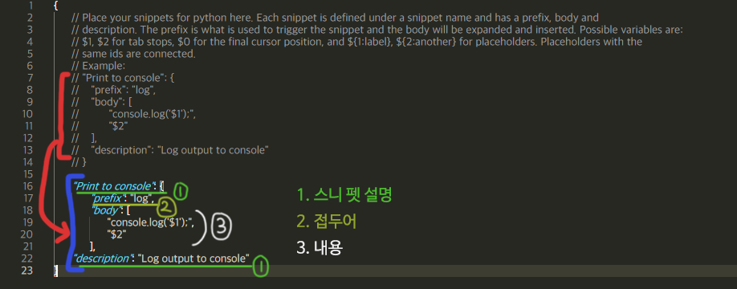
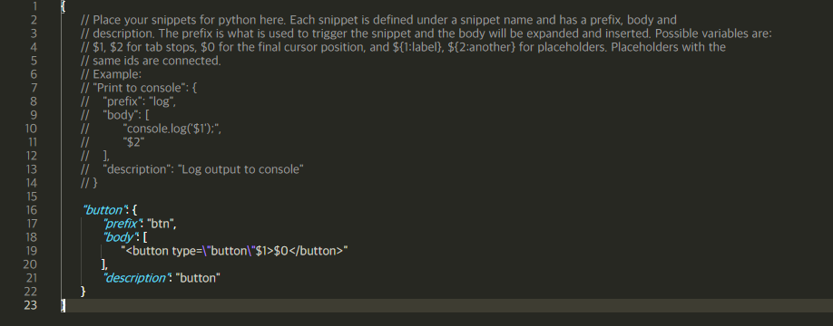
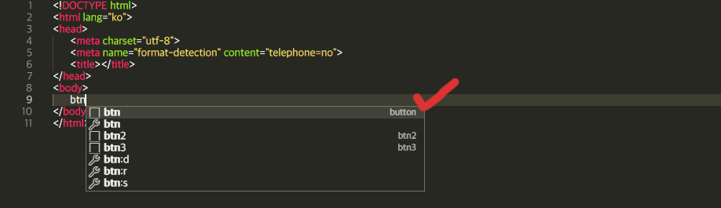
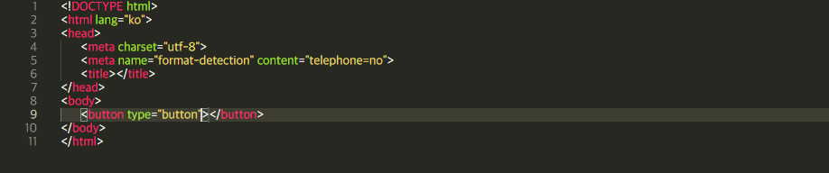

# **VSCode에서 snippets 활용하기**



## **snippets(스니펫)이란?**
재사용 가능한 소스 코드, 기계어, 텍스트의 작은 부분을 일컫는 프로그래밍 용어

---

자주 사용하는 코드를 손쉽고 빠르게 작성하기 위해 복사 + 붙여넣기가 많이 사용되지만 더 좋은 방법이 있다.  
능률을 200% 끌어올려주는 필수 기능! 바로 스니펫이다.  
쉽게 이해하자면 **'단축어'** 라고 볼 수 있다.

우선 vscode에는 기본적으로 제공되는 내장 스니펫이 있다.  
예를 들어 js파일에서 'ifelse'를 입력하면 아래와 같다.  


위 사진처럼 스니펫 접두어가 나타나게 된다.  


Enter를 쳐보면 위 사진처럼 자동으로 코드가 완성된다.  
이런 식으로 vscode에는 여러 종류의 내장 스니펫이 있다.  
그리고 나만의 스니펫도 만들 수 있다.  
본인이 자주 쓰는 html, css, js  등 템플릿을 등록해놓고 명령어 하나만 입력하면 자동 완성되는 것이다.

## **스니펫 만드는 방법**
1) F1(명령 팔레트 활성화) -> 'snippets' 입력


2) html 선택


3) line 7~13 복사 후 수정


중요한 것은 2번 **prefix**와 3번 body이다.  
**prefix**는 코드 조각의 이름(단축어)이다.  
**body**에는 어떤 코드를 입력할지 내용을 적으면 된다.

예시로 `btn`을 입력하면 `<button type "button"></button>`의 버튼 태그를 만드는 스니펫을 만들면 아래와 같다.  


**$1**은 첫 번째 커서의 위치이다.  
탭을 눌러서 원하는 위치로 이동시킬 수 있다.  
그럴 때에는 **$2**를 추가해주면 된다.  
**$0**은 마지막 커서의 위치입니다.

html 파일로 이동하여 btn을 입력하면 아래와 같이 직접 만든 접두어와 설명이 보인다.  


해당 스니펫을 선택하면 끝이다.  


스니펫 기능을 활용하여 얼마든지 템플릿을 확장시킬 수 있다.  
`\t`으로 코드 상 tab을 추가할 수도 있다.
```js
{
	"btn example": {
		"prefix": "my btn",
		"body": [
			"<button type=\"button\"$1>$0</button>"
		],
		"description": "btn example"
	},
	"ul example": {
		"prefix": "my ul",
		"body": [
			"<ul>",
			"\t<li>",
			"\t<li>",
			"\t<li>",
			"</ul>"
		],
		"description": "ul example"
	}
}
```