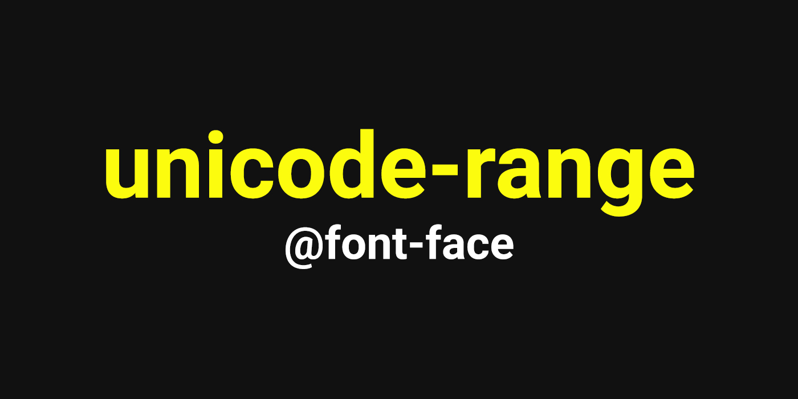

# **언어 별로 폰트를 적용하는 방법 unicode-range**



> **_"영문은 Roboto로 적용 해주시고, 한글은 나눔 스퀘어로 적용해 주시고, 숫자는 Noto Sans로 적용해 주세요."_**  

만약 이런 요청이 있다면 태그로 각각 감싸주지 않아도 [unicode-range](https://developer.mozilla.org/en-US/docs/Web/CSS/@font-face/unicode-range)를 이용하면 쉽게 적용이 가능하다.  
unicode-range는 @font-face로 정의된 폰트를 특정 범위의 글자에만 설정하는 방법이다.  
페이지 내에 해당 범위의 글자가 없으면 폰트를 다운로드하지 않는다. HTML 문서에 적어도 한 글자 이상이 있어야만 다운로드한다.

## **적용 방법**
```css
@font-face	{
	font-family:'Roboto';
	src:url('font/Roboto-Regular.woff') format('woff');
	unicode-range:U+0041-005A, U+0061-007A;	/* 영문 대소문자 */
}

@font-face	{
	font-family:'NanumSquare';
	src:url('font/NanumSquareR.woff') format('woff');
	unicode-range:U+AC00-D7A3;	/* 한글 */
}

@font-face	{
	font-family:'Noto Sans';
	src:url('font/Noto Sans.woff') format('woff');
	unicode-range:U+0030-0039;	/* 숫자 */
}

body	{font-family:'Roboto', 'NanumSquare', 'Noto Sans', sans-serif;}
```

## **유니코드 범위**
* 영문: U+0041-005A(대문자), U+0061-007A(소문자)
* 한글: U+AC00-D7A3
* 숫자: U+0030-0039
* 특수문자: U+0020-002F, U+003A-0040, U+005B-0060, U+007B-007E

## **참고할 만한 사이트**
* https://en.wikipedia.org/wiki/List_of_Unicode_characters
* https://docs.automationanywhere.com/ko-KR/bundle/enterprise-v2019/page/enterprise-cloud/topics/aae-client/bot-creator/using-variables/unicode-range.html
* https://www.unicode.org/charts/